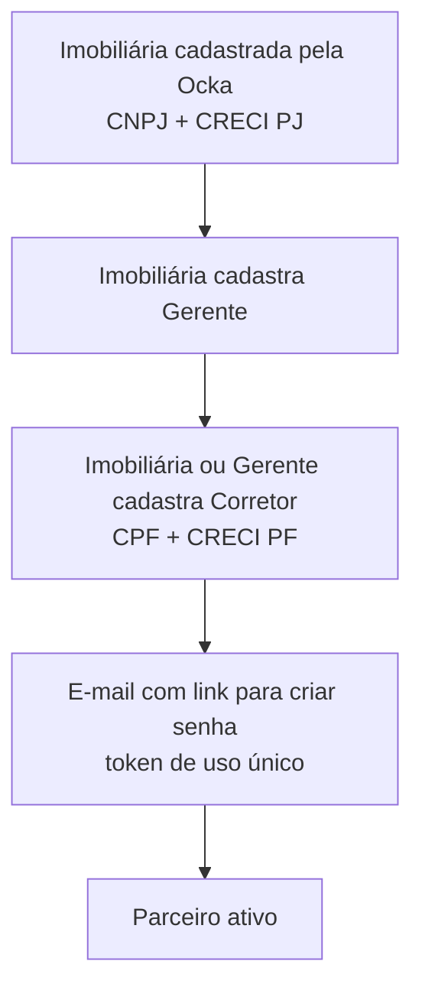
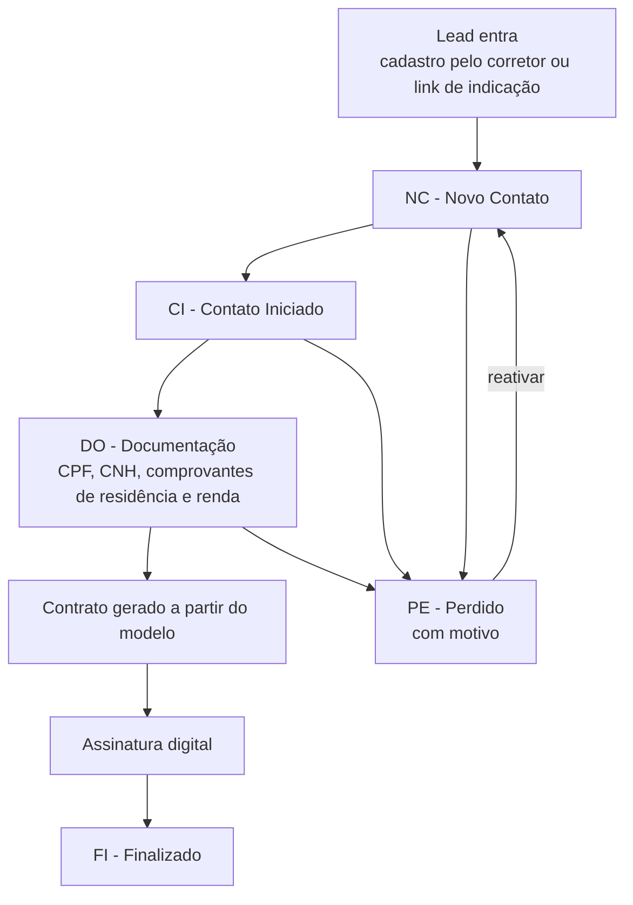
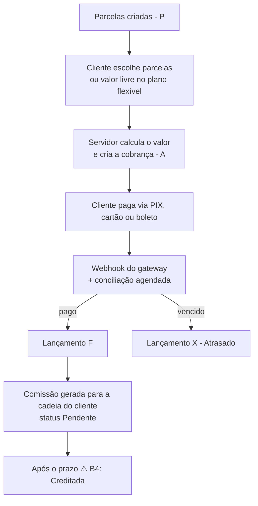
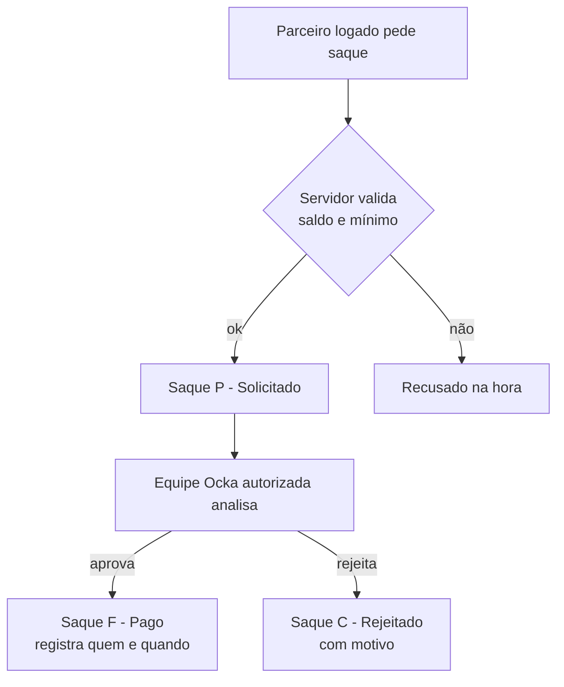
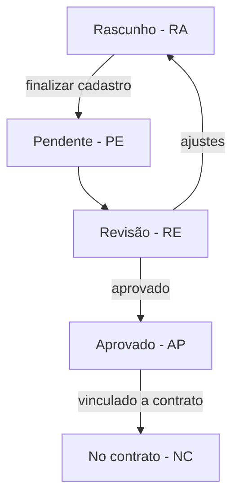

# Fluxos de Trabalho

> **Atualizado em 28/09/2026.** Cada fluxo mostra o **alvo do novo sistema** e, quando diferente, **o que acontece hoje**. Itens ⚠️ estão em [decisoes-pendentes.md](./decisoes-pendentes.md).
> Papéis usados: **Parceiro** (imobiliária, gerente, corretor; ver [area-parceiros.md](./area-parceiros.md)), **Equipe Ocka** (perfis internos), **Cliente**, **Sistema**.

## 1. Cadastro de parceiros

- Cada cadastro nasce **vinculado ao pai** e grava os IDs da cadeia (imobiliária, gerente).
- **Hoje:** o parceiro também pode entrar pelo **pré-cadastro público** usando o link de indicação de outro parceiro (`/pre-cadastro/corretor/{id}`, `/pre-cadastro/imobiliaria/{id}`). ⚠️ Decidir se o autocadastro continua e se precisa de aprovação.

## 2. Captação e venda (funil)

| Etapa | Quem | O que acontece |
|---|---|---|
| Entrada do lead | Corretor (ou link de indicação) | Checa duplicidade por CPF ⚠️ (A2); lead vinculado ao corretor; consentimento LGPD registrado |
| NC → CI | Corretor | Primeiro contato feito |
| CI → DO | Corretor | Sistema solicita os documentos básicos ao cliente |
| DO | Cliente envia; Equipe/Corretor analisa | Documento: pendente → em análise → aprovado/rejeitado ⚠️ (F4) |
| Contrato | Equipe/Corretor | Simulação (valor, % aporte, entrada, parcelas) calculada **no servidor**; texto gerado do modelo |
| Assinatura | Cliente + signatários ⚠️ (D3) | PDF enviado ao serviço de assinatura; status `AP` |
| FI | Sistema | Quando o webhook confirma todas as assinaturas: contrato `A`, lead `FI`, parcelas geradas |

**Hoje:** não há validação entre etapas; o lead novo fica sem etapa; não há como marcar "Perdido"; o contrato nunca passa de `AP`.

## 3. Pagamento e comissão

Percentuais e regras: [modulo-financeiro.md](./modulo-financeiro.md) ⚠️ (B1–B3).
**Hoje:** o valor cobrado vem do navegador; a confirmação é só pela rotina agendada; a comissão nunca passa para "creditada" automaticamente.

## 4. Saque

**Hoje:** o mínimo (R$ 100) e o saldo são checados só na tela; qualquer pessoa, **mesmo sem login**, aprova ou rejeita por um link; não se registra quem aprovou.

## 5. Transferências e desligamentos (novo; não existe hoje)

| Evento | Regra |
|---|---|
| Transferir cliente para outro corretor | Imobiliária ou gerente (dentro da equipe). Atualiza `corretor_id`/`gerente_id` do cliente. ⚠️ Comissões futuras (B5). |
| Transferir corretor para outro gerente | Só a imobiliária. Atualiza o corretor **e todos os clientes dele**. |
| Inativar corretor | Obriga transferir a carteira antes. |
| Inativar gerente | Obriga transferir os corretores antes. |
| Corretor muda de imobiliária | Os clientes **ficam** na imobiliária de origem. |

Toda transferência grava log de auditoria (quem, quando, de → para).

## 6. Cadastro de imóvel

**Hoje:** só existem os passos Rascunho → Pendente. Nada leva o imóvel a Revisão, Aprovado ou No contrato ⚠️ (E2). Frações: ver [modulo-imobiliario.md](./modulo-imobiliario.md) ⚠️ (E1).

## 7. Colaborador interno (Capital Humano)

Equipe Ocka cadastra o colaborador → e-mail com link para criar senha → colaborador ativo. Status: Ativo/Inativo. Ponto eletrônico ⚠️ (G1). Detalhes em [modulo-capital-humano.md](./modulo-capital-humano.md).

## 8. Notificações por e-mail

| Existe hoje | Requisito do novo sistema ⚠️ |
|---|---|
| Boas-vindas / pré-cadastro por tipo (cliente, corretor, imobiliária, investidor) | Documento solicitado / rejeitado |
| Esqueci a senha (link válido por 24 h) | Contrato enviado para assinatura / assinado |
| Senha alterada | Cobrança gerada / pagamento confirmado / parcela atrasada |
| | Comissão creditada / saque aprovado ou rejeitado |
| | Transferência de cliente ou corretor |

## 9. Auditoria (novo; não existe hoje)

Registrar em log imutável: login e falhas de login, cadastro/edição/inativação, transferências, mudanças de etapa, geração e assinatura de contrato, pagamentos, comissões, pedidos e aprovações de saque, alteração de configurações, **consulta a dados pessoais de cliente**.

## 10. Removido da documentação antiga

Os fluxos de "aprovação de proposta por supervisor", "relatórios", "tickets de manutenção" e "backup" descreviam processos que não existem no sistema nem em definição de negócio. Os perfis "Supervisor", "RH", "Financeiro" e "Auditor" citados neles não existem. Backup e auditoria viraram requisitos em [visao-geral.md](./visao-geral.md#requisitos-não-funcionais-do-novo-sistema).
